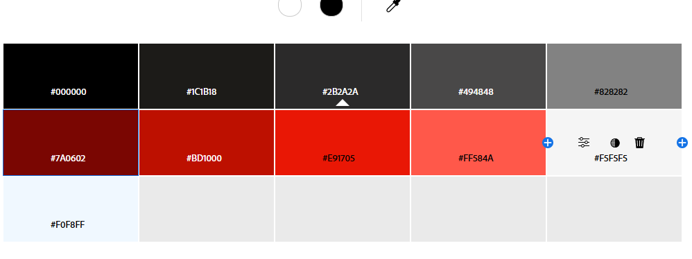

# About Me Project
Kevin Gonzalez 2024

  

## Badges
This badge shows a successful deployment of my website on Netlify.

  

## Description
The purpose of this project was to learn how to create a functional webpage for desktop and mobile devices using HTML and CSS. I will discuss the sections of my webpage by display order below, and what I learned from each section.

### \<head> Element
The head element contains the metadata and title of my webpage. By creating the head element, I learned how to set the character set, viewport properties such as width and initial zoom, and creating link elements to import fonts and stylesheets, and setting the title of my webpage.

### \<body> Element
Throughout this project, I iterated upon the body element of my HTML constantly. I learned that the body element contains all of the main content of my page, how nested elements inherit properties of their parent elements. Knowing this, I edited the body tag in my CSS to include a basic font of "Arial", a background color for the entire page, a color for all text, and a text shadow to outline all of my text for contrast purposes.

### \<header> Element
I learned that the header element is used to create introductory content for my webpage, and typically features a search bar, navigation bar, logo, and/or the author's name. In my header, I learned how to append images, create classes, IDs, and links to other areas of my webpage. I also learned how to use lists, change list styles, and create visual effects when selecting, clicking, or hovering links. Later, I created my own logo which I added as a favicon.

#### Navigation Bar
Creating a navigation bar taught me how to send a user directly to other areas of my webpage, how to adjust scroll behavior, and how to set fixed positions for elements. While creating a fixed navbar, I had several issues. Firstly, the navbar was overlapping my hero which I fixed by adding margin to the top of my hero. Then, when clicking links in my navbar, the fixed bar then overlapped the content I wished to present. I fixed this by adding the scroll-margin-top rule to my CSS, to offset the scrolling by the height of the navbar. I then added a button to take the user back to the top of the page by fixing the button position to the bottom right, and linking the button to my hero.

### Main Element
The main element contains the "meat" of this project--it's where I actually put the stuff that's about me! In this section there are \<section> tags that divide my content into: my hero (which contains information about me such as a picture, my name, and town), my biography, hobbies, a photo gallery, blog posts, a video about my midterm, and a contact form. I learned how to use \<figure> and \<figcaption> tags to organize my photos and make my gallery pop. I also learned how to append \<iframe> tags to embed media such as youtube videos to my page. Using the \<form> tag, I learned how to create a form, allow user input, make certain inputs required, and how to collect submitted data. While I've mostly used display:flex for my elements, in the gallery and forms I learned how to use display:grid.
### Media Query
By using @media screen and setting proportions, I learned how to make websites that are mobile conscious. By designing for mobile sites first and then  using a media query, we can ensure that the websites we create are scalable and look good on any device. I used the Media Query to change my scroll to top button, and added a hamburger navbar to mobile.

## Color Scheme
When I first started my About Me, I knew I wanted to use a color scheme involving red, gray, and black but I also knew that I might run into accessibility issues if I chose the wrong shades. Initially, I used the shade #bd1000 for text, but after using the Lighthouse tool in DevTools,  I found the contrast to only be rated 2.25. Thankfully, Lighthouse has an easy one click fix to take your color up to a 4 rating, and I ended with using #e91705 for my red text. The background for the form input boxes also failed to reach an acceptable rating and so I change the color from #494848 to #828282. Below you will find the color swatches that I used in the final iteration of my project. 
  

## Citations
Below are websites I used to write my blog post about CSS Animations. Some animations have been taken directly from these sources and injected into my code. Even if they are modified they are NOT my work.

https://developer.mozilla.org/en-US/docs/Web/CSS/CSS_animations/Using_CSS_animations#configuring_an_animation

https://developer.mozilla.org/en-US/docs/Web/CSS/animation

https://developer.mozilla.org/en-US/play

## License